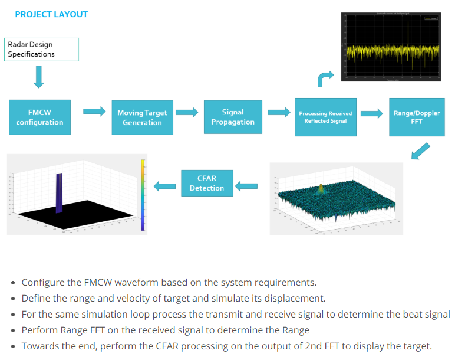
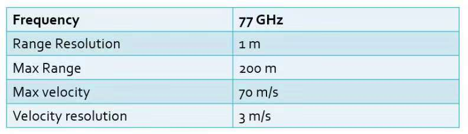
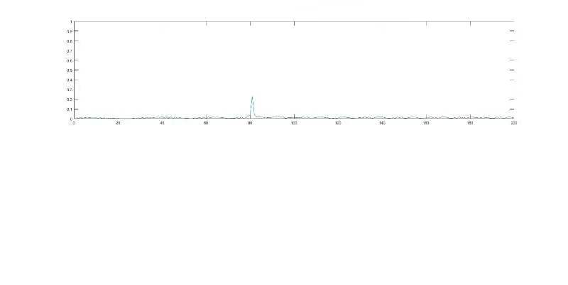
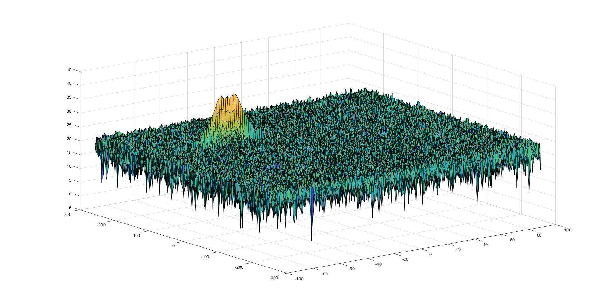
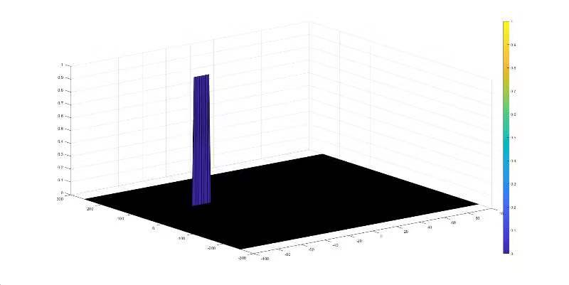

# Radar Target Generation and Detection

Udacity sensor fusion project

## Project Layout:



## Radar System Requirements:


## Rubric Points
### FMCW Waveform Design
- Frequency of operation = 77GHz
- Max Range = 200m
- Range Resolution = 1 m
- Max Velocity = 100 m/s
```
d_res = 1;
c = 3*10^8;
RMax = 200;
Bsweep = c/(2*d_res);  %Bandwidth
Tchirp = 5.5*2*RMax/c; %chirp time
alpha = Bsweep/Tchirp; %slope of chirps
fc= 77e9;             %carrier freq (given)
```

### Simulation Loop
To simulate Target movement and calculate the beat or mixed signal for every timestamp.
```
d0 = 80;
v0 = -50;
Nd=128;                   % #of doppler cells OR #of sent periods % number of chirps
Nr=1024;                  %for length of time OR # of range cells
t=linspace(0,Nd*Tchirp,Nr*Nd); %total time for samples


%Creating the vectors for Tx, Rx and Mix based on the total samples input.
Tx=zeros(1,length(t)); %transmitted signal
Rx=zeros(1,length(t)); %received signal
Mix = zeros(1,length(t)); %beat signal

%Similar vectors for range_covered and time delay.
r_t=zeros(1,length(t));
td=zeros(1,length(t));
for i=1:length(t)         
    
    
    % *%TODO* :
    %For each time stamp update the Range of the Target for constant velocity. 
    r_t(i) = d0 + v0*t(i);
    td(i) = 2*r_t(i)/c;
    
    % *%TODO* :
    %For each time sample we need update the transmitted and
    %received signal. 
    Tx(i) = cos(2*pi*(fc*t(i)+alpha*t(i)^2/2));
    Rx(i) = cos(2*pi*(fc*(t(i)-td(i)) + (alpha*(t(i)-td(i))^2)/2));
    
    % *%TODO* :
    %Now by mixing the Transmit and Receive generate the beat signal
    %This is done by element wise matrix multiplication of Transmit and
    %Receiver Signal
    Mix(i) = Tx(i).*Rx(i);  %Beat Signal
    
end
```

### Range FFT (1st FFT)
Implement the Range FFT on the Beat or Mixed Signal and plot the result.
```
%Range and Doppler FFT respectively.
Mix = reshape(Mix,[Nr,Nd]);
%normalize.
sig_fft1 = fft(Mix,Nr); 
sig_fft1 = sig_fft1./Nr;
% Take the absolute value of FFT output
sig_fft1 = abs(sig_fft1);
% Hence we throw out half of the samples.
single_side_sig_fft1 = sig_fft1(1:Nr/2);
```


### Doppler FFT (2nd FFT)
```
% 2D FFT using the FFT size for both dimensions.
sig_fft2 = fft2(Mix,Nr,Nd);

% Taking just one side of signal from Range dimension.
sig_fft2 = sig_fft2(1:Nr/2,1:Nd);
sig_fft2 = fftshift (sig_fft2);
RDM = abs(sig_fft2);
RDM = 10*log10(RDM);
%use the surf function to plot the output of 2DFFT and to show axis in both
%dimensions
doppler_axis = linspace(-100,100,Nd);
range_axis = linspace(-200,200,Nr/2)*((Nr/2)/400);
figure('Name','Range from Second FFT'),surf(doppler_axis,range_axis,RDM);
```


### 2D CFAR
Implement the 2D CFAR process on the output of 2D FFT operation. 
Determine the number of Training cells for each dimension. Similarly, pick the number of guard cells.
```
%Select the number of Training Cells in both the dimensions.
Tr = 10;
Td = 8;
% *%TODO* :
%Select the number of Guard Cells in both dimensions around the Cell under 
%test (CUT) for accurate estimation
Gr = 4;
Gd = 4;
% *%TODO* :
% offset the threshold by SNR value in dB
offset = 1.4;
```
Slide the cell under test across the complete matrix. Make sure the CUT has margin for Training and Guard cells from the edges. Add the offset into threshold and compare the signal against this threshold. If CUT level > threshold assign it a value 1, else equate it to 0.
```
for i = Tr+Gr+1:(Nr/2)-(Gr+Tr)
    for j = Td+Gd+1:Nd-(Gd+Td)
        
       %initial noise level for each iteration
        noise_level = 0;
        
        % Calculate noise SUM in the area around CUT
        for p = i-(Tr+Gr) : i+(Tr+Gr)
            for q = j-(Td+Gd) : j+(Td+Gd)
                if (abs(i-p) > Gr || abs(j-q) > Gd)
                    noise_level = noise_level + db2pow(RDM(p,q));
                end
            end
        end
        
        % Calculate threshould from noise average then add the offset
        threshold = pow2db(noise_level/(2*(Td+Gd+1)*2*(Tr+Gr+1)-(Gr*Gd)-1));
        threshold = threshold + offset;
        CUT = RDM(i,j);
        
        if (CUT < threshold)
            RDM(i,j) = 0;
        else
            RDM(i,j) = 1;
        end
        
    end
end
```
